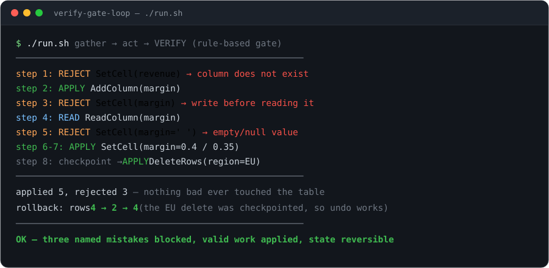
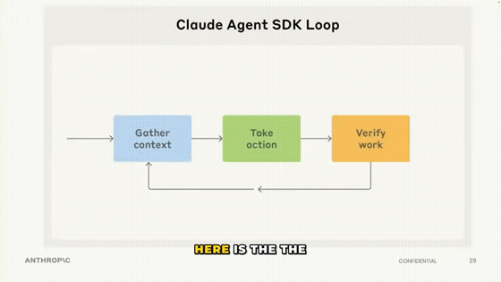

<div align="center">


# verify-gate-loop

**An agent loop where the third step — verify — is a gate, not an afterthought.**

[Lecture → code](LECTURE.md) · [Run it](#run-it) · [Plug in a real model](#plug-in-a-real-model)

 &nbsp; &nbsp; &nbsp;

 &nbsp; &nbsp;

<br>



</div>

---

`gather context → take action → verify the work`. Every proposed action is checked by deterministic rules *before* it can touch the data. A rejection never mutates anything; its reason is fed back as the next attempt's context. State is checkpointed before anything destructive, so it can be rolled back.

Built from one line in Anthropic's Claude Agent SDK workshop:

> "here is the three parts to an agent loop. So, first, it's gather context. Second is taking action, and the third is **verifying the work**."
> — [22:20](https://www.youtube.com/watch?v=OZ9NhFwVCtQ&t=1340s)

Full timestamped map of lecture → code: [LECTURE.md](LECTURE.md).

## Run it

No install. No API key. No network.

```bash
git clone https://github.com/Archive228/verify-gate-loop
cd verify-gate-loop
./run.sh
```

Three rejections are the exact mistakes the workshop calls out (unknown column, write-before-read, null value). None of them touched the table. The destructive delete was reversible because the loop checkpointed first (see the demo above).

## The shape

```
agent ── proposes op ──► verify(op) ──► pass → apply (checkpoint first if destructive)
   ▲                                    fail → reason becomes the next prompt
   └──────────── last_reason ───────────────────┘
```

| file | what it is |
|---|---|
| `src/loop.py` | `run_loop()` — gather → act → verify; nothing mutates until verify passes |
| `src/verifier.py` | the rule-based gate: column-exists, read-before-write, null, row-cap |
| `src/table.py` | in-memory table with `checkpoint()` / `rollback()` |
| `src/operations.py` | `ReadColumn` / `SetCell` / `AddColumn` / `DeleteRows` as inspectable data |
| `src/scripted_agent.py` | offline deterministic agent (swap in a model — same signature) |

## Plug in a real model

The agent is just `(columns, last_reason) -> operation | None`. A model-backed agent reads `last_reason` — the verifier's rejection text — and repairs its own proposal, which is the whole point of returning failures as text:

```python
def claude_agent(columns, last_reason):
    prompt = f"Columns: {columns}. Propose the next table operation as JSON."
    if last_reason:
        prompt += f"\nYour last op was rejected: {last_reason}. Fix it."
    return parse(call_model(prompt))   # your call; must return an Operation
```

## Tests

```bash
python3 -m unittest discover -s tests -v   # 11 tests
```

They test the gate and the loop: rejections never mutate, every rule fires, rollback restores state.

## Honest limits

- **Verification only works where a real rule exists.** Table edits, schemas, parsing, types. There is no rule here for "is this analysis any good" — the workshop says as much (deep research verifies only by citing sources).
- **The scripted agent is deterministic on purpose** — so the demo runs offline and always shows the same three rejections. Swap in a model for real work.

## License

MIT — see [LICENSE](LICENSE). All code here is original; nothing is vendored.

---

<div align="center">

**The lecture moment this repo is built from:**



<sub>Anthropic — <a href="https://www.youtube.com/watch?v=OZ9NhFwVCtQ">Claude Agent SDK workshop</a> · 22:20</sub>

<br><br>

Built from a real lecture, quoted verbatim with timestamps in [LECTURE.md](LECTURE.md) — not a rehash of a rehash.<br>If it made the idea click, ⭐ it.

</div>
